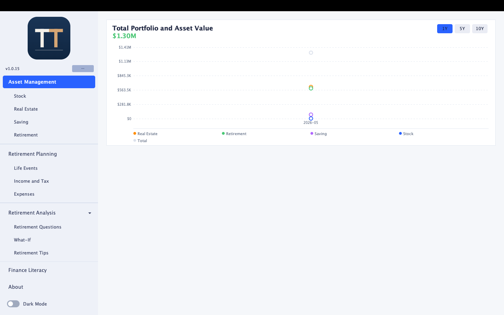
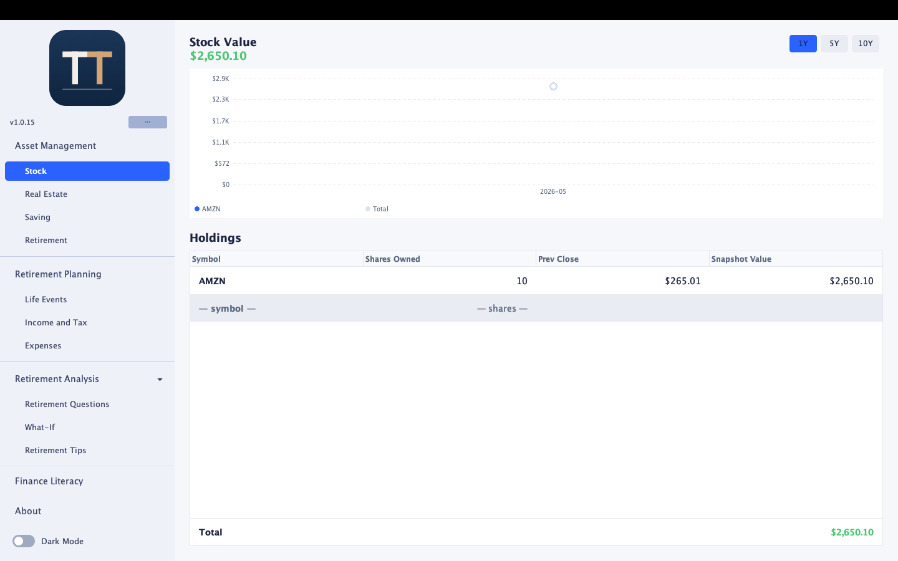
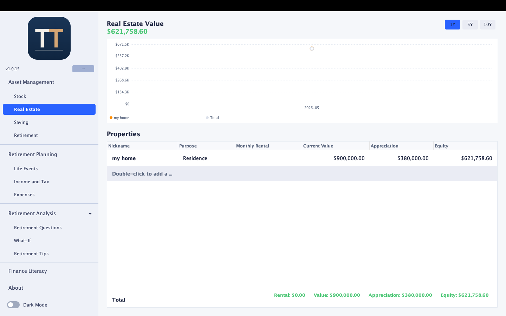
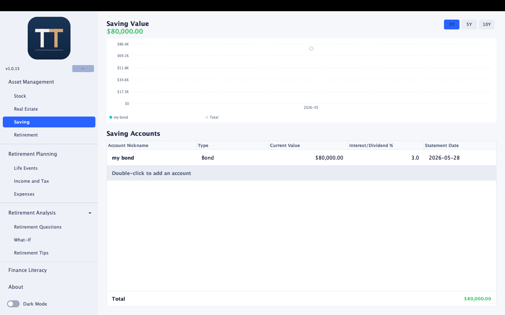
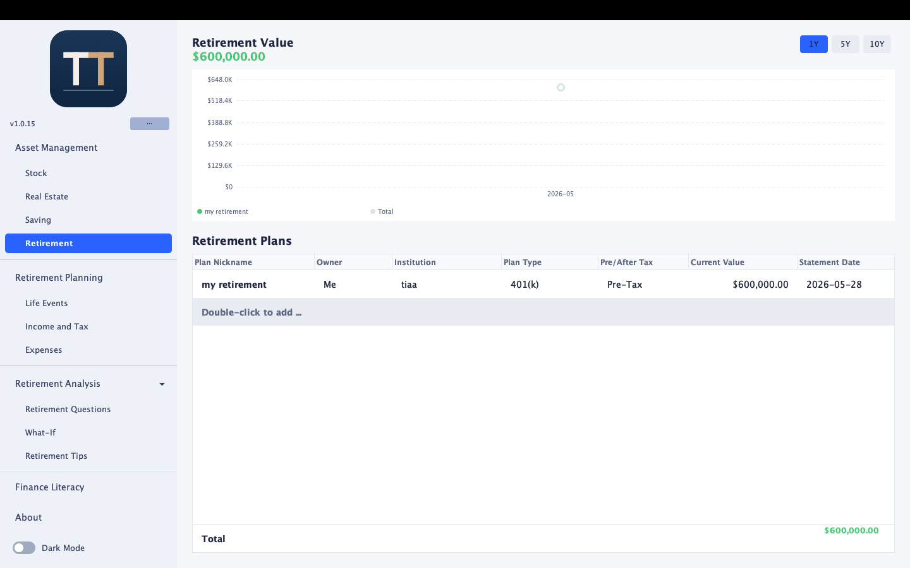
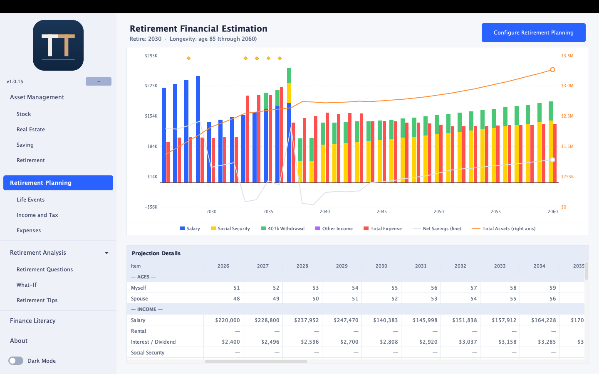
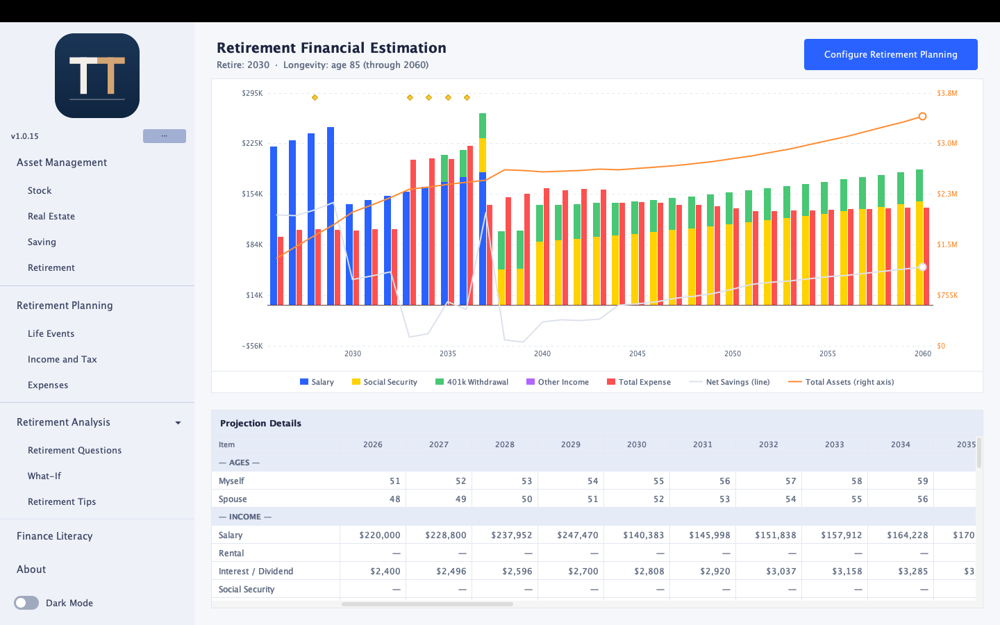
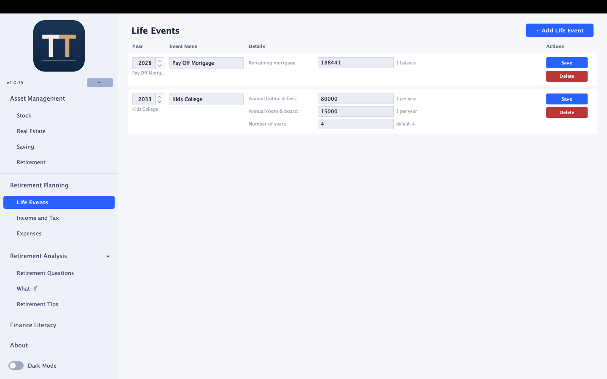
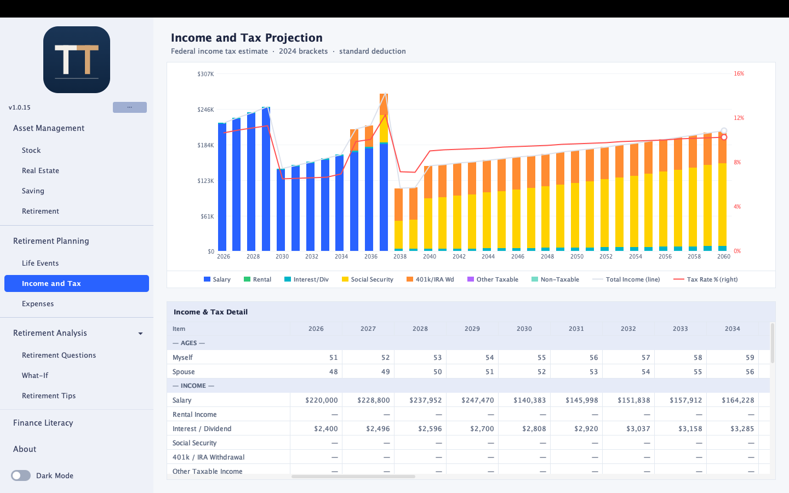
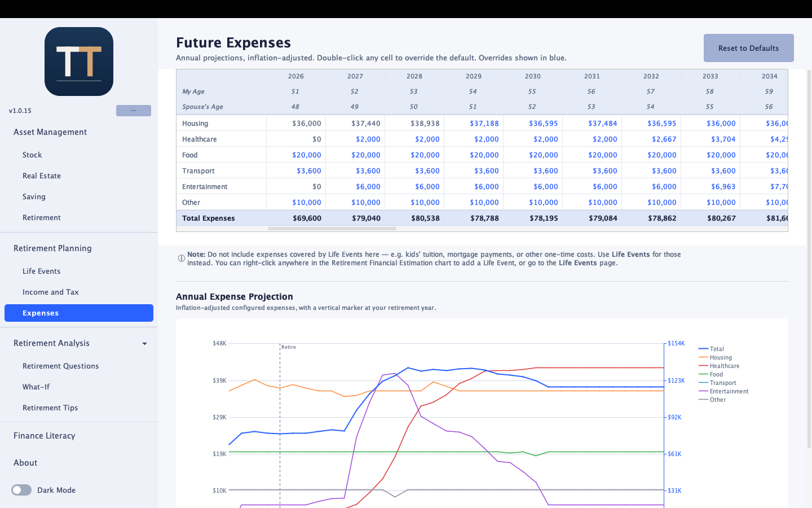

# About Tutu &nbsp; 

## What is Tutu?

Tutu is a financial planning and retirement planning software that helps you track, analyze, and project your financial life — all in one place.

## Who is it for?

Tutu is useful for everyone on the financial journey — from the new graduate who just started their first job and wants to build good habits, to the person who is approaching retirement and would like to access their financial readiness or already retired and wants to stay on top of their financial health.

## What features does it have?

**Asset Management**
- **Overview** — A dashboard showing your total net worth with historical charts across all asset types and cashflow trends.
- **Stock** — Track your stock and investment portfolio with live price updates from Yahoo Finance and historical performance charts.
- **Real Estate** — Manage your property holdings, track values, rental income, and mortgage details.
- **Saving** — Monitor your savings and cash accounts over time.
- **Retirement** — Track your retirement accounts (401k, IRA, etc.) and watch them grow.

**Retirement Planning**
- **Retirement Planning** — A step-by-step configuration wizard that sets up your retirement plan, modeling withdrawals (fixed, percentage, or RMD), Social Security, inflation, spouse income, and planned life events.
- **Retirement Estimation** — A detailed year-by-year projection chart and table showing how your assets will grow and be drawn down through retirement.
- **Life Events** — Plan major financial life events (buying or selling a home, college costs, new baby, job loss, inheritance, wedding, medical expenses, and more) and see their impact on your retirement trajectory.
- **Income and Tax** — Project your year-by-year income from all sources alongside a federal income tax estimate, so you can plan withdrawals with tax efficiency in mind.
- **Expenses** — Plan your year-by-year living expenses with inflation-adjusted projections across spending categories (Housing, Healthcare, Food, Transport, Entertainment, and Other), override any cell by year, and explore the data through an interactive multi-line chart with drag-to-edit support.

**Retirement Analysis**
- **Retirement Questions** — Personalized answers to common retirement questions based on your planning data.
- **What-If Scenarios** — Explore alternative financial decisions without changing your existing retirement plan.
- **Retirement Tips** — Financial health tips and tax optimization suggestions generated by scanning your current data and retirement configuration.

**Finance Literacy** — Financial and retirement concepts explained in plain language, covering topics such as compound interest, tax brackets, Roth conversions, RMDs, sequence of returns risk, withdrawal rate, and more.

## Why does Tutu only have a desktop version?

This is a deliberate choice to protect your privacy. Tutu will NEVER upload any of your financial information to the cloud. Everything stays on your local computer — forever. The only internet connection Tutu ever makes is to Yahoo Finance to fetch stock prices when you request a snapshot update or ping Github for the latest version and download it if detected.

## Screenshots

### Asset Management

| Overview | Stock |
|----------|-------|
|  |  |

| Real Estate | Saving |
|-------------|--------|
|  |  |

| Retirement | |
|------------|--|
|  | |

### Retirement Planning

| Retirement Planning | Retirement Estimation |
|---------------------|-----------------------|
|  |  |

| Life Events | Income and Tax |
|-------------|----------------|
|  |  |

| Expenses | |
|----------|--|
|  | |

## I got an installation error on Mac, what should I do?

Tutu is currently not signed by an Apple developer certificate, so macOS Gatekeeper will block it from opening by default. Follow these steps to allow it:

**Option A — Right-click to open (easiest, one-time only)**

1. Open **Finder** and navigate to your **Applications** folder (or wherever you copied Tutu).
2. **Right-click** (or Control-click) the Tutu icon and choose **Open** from the menu.
3. A dialog will appear saying the app is from an unidentified developer. Click **Open** to proceed.
4. macOS remembers this choice — you can double-click Tutu normally from now on.

**Option B — System Settings (if Option A does not work)**

1. Try to open Tutu by double-clicking it. macOS will show a blocking dialog — click **Done** (do not click "Move to Trash").
2. Open **System Settings** → **Privacy & Security**.
3. Scroll down to the **Security** section. You will see a message like *"Tutu was blocked because it is not from an identified developer."*
4. Click **Open Anyway** next to that message.
5. Confirm by clicking **Open** in the dialog that appears.

**Option C — Terminal (if both options above fail)**

Open **Terminal** and run:

```bash
xattr -cr /Applications/Tutu.app
```

Then double-click Tutu to open it normally. This command removes the macOS quarantine flag that Gatekeeper uses to block unsigned apps.

> **Why does this happen?** Apple requires apps distributed outside the Mac App Store to be signed and notarized. This is a paid developer program ($99/year). Tutu is a free hobby project and has not gone through that process yet. The app itself is safe — you can inspect the full source code at the project repository.

## Need Support or have feedback or feature request?

Email us at lihua.cao2007@gmail.com. This is only a hobby project so far, but we will try to respond as fast as we can.

## Release Notes

### v1.0.16 — 2026-05-30

**Customize Some Planning Configuration (new wizard step)**
- Added a dedicated "Customize Some Planning Configuration" step in the Retirement Planning wizard, positioned between Retirement Withdrawal and Future Expenses.
- Moved "Expected inflation rate (%)" here from the Retirement Timeline step.
- Moved "Expected annual return (%)" here from the Retirement Withdrawal step and renamed it "Expected retirement annual return (%)" for clarity.
- Added "Expected Stock Asset annual return (%)" (default 7.0%) — controls how the stock portfolio grows year over year in all projections.
- Added "Expected Real Estate annual return (%)" (default 4.0%) — controls how real estate value appreciates year over year; previously this was hardcoded to half the inflation rate.

**Projection calculation improvements**
- Retirement accounts (401k/IRA), stock assets, and real estate now each use their own independently configurable annual return rate instead of sharing a single rate.

**README and About page**
- Added a Screenshots section to the README showing all Asset Management and Retirement Planning panels.
- Added a detailed macOS Gatekeeper workaround guide ("I got an installation error on Mac") with three options: right-click open, System Settings, and Terminal xattr command.
- Removed the completed "Support More Life Events" TODO item from both the README and the About page.

---

### v1.0.15 — 2026-05-28

**Annual Expense Projection chart (major enhancement)**
- Replaced the single total-expenses line with a multi-line chart: one colored line per spending category (Housing, Healthcare, Food, Transport, Entertainment, Other) plus a Total line.
- Drag any category data point up or down to instantly adjust the expense value for that year; releasing the mouse commits the change to the table and database.
- Hover tooltip shows the category name, annual value, monthly value (annual ÷ 12), year, and your age at that year.
- Dual Y-axis: category lines scale against the left axis; the Total line has its own right axis rendered in blue.
- Vertical dotted crosshair highlights the hovered year column.

**Finance Literacy new terms**
- Added "Retirement Spending Smile" — David Blanchett's research on how retiree spending follows a U-shaped curve across go-go, slow-go, and no-go phases.
- Added "Backdoor Roth Conversion" — a strategy for high earners to fund a Roth IRA by contributing to a Traditional IRA and converting it.

**Income and Tax projection improvement**
- Standard deduction is now projected at a conservative 2.3 %/yr growth rate (half the 30-year historical CAGR) to account for the outsized 2017 Tax Cuts and Jobs Act jump that inflated the long-run figure.

**About and README updates**
- Feature list updated to include Expenses, the Retirement Analysis suite (Retirement Questions, What-If, Retirement Tips), and Finance Literacy.
- TODO list updated: renamed "Projection Improvements" to "Retirement Analysis", added capital gain tax item, added "basic personalized Q&A" item.

---

### v1.0.13 — 2026-05-25

**Future Expenses panel (new)**
- Added "Expenses" sub-menu under Retirement Planning in the sidebar.
- Year-by-year table showing inflation-adjusted annual expenses for Housing, Healthcare, Food, Transport, Entertainment, and Other.
- Two read-only rows at the top of the table display your age (and spouse's age if configured) for each projected year — making it easy to spot which year to customize.
- Double-click any expense cell to open an edit dialog with annual and monthly amount fields that auto-sync with each other (edit one, the other updates instantly).
- "Bulk update through year" dropdown in the edit dialog labels each year with ages (e.g. "2035 — Me 52, Spouse 50") so you know exactly what life stage you are customizing for.
- Overridden cells are highlighted in blue; "Reset to Defaults" button clears all overrides.
- Expense overrides feed directly into the Living Expenses row in Retirement Financial Estimation.
- A note below the table reminds users to use Life Events for one-time costs (tuition, mortgage payoff, etc.) rather than this panel.

**Retirement Finance Literacy panel (new)**
- Added "Finance Literacy" nav item above About in the sidebar.
- 16 financial and retirement concepts explained in plain language, in alphabetical order: 401(k)/403(b), Capital Gain, Compound Interest, Inflation, Medicare, Mortgage, Net Worth, Property Tax, RMD, Retirement Plans & Contributions, Roth IRA & Roth IRA Conversion, Sequence of Returns Risk, Social Security, Tax Brackets, Traditional IRA, and Withdrawal Rate.

**Dark Mode toggle redesigned**
- Replaced the small icon-only toggle with a full-width row showing a pill-style switch and a "Dark Mode" label — making its purpose immediately clear.

**Light mode bug fixes**
- Cancel button in the "Add / Edit Retirement Plan" dialog no longer shows a dark background in light mode.
- Mouse-over of type-selection, Cancel, and Back buttons in the "Add Life Event" dialog now uses the correct theme-aware hover color in both light and dark modes.

**Projection Details table**
- Renamed "Monthly Rental" row to "Rental" — the value has always been the annual figure.

**Windows installer (new)**
- Starting with this release, a Windows installer (`Tutu-1.0.13-Windows.exe`) is provided alongside the macOS disk image (`Tutu-1.0.13-macOS.dmg`).
- Binary filenames now include the OS to avoid ambiguity.

---

### v1.0.12 — 2026-05-24

**Dark mode polish**
- All panels (Retirement Planning, Life Events, Income and Tax) now fully respect dark mode — panel headers, borders, and section backgrounds are consistent with other panels.
- Life Events table no longer shows a white border around the scroll area in dark mode.
- Retirement Planning wizard: the "Do you have a spouse" checkbox and "Back" navigation button now correctly use the dark theme background instead of rendering white.
- Retirement Financial Estimation bar chart: tooltip now uses the correct light/dark background and border colors — previously showed a dark tooltip even in light mode.
- Chart backgrounds (Overview, Retirement Financial Estimation, Income and Tax Projection) are now consistent with the theme across both modes.
- Navigation panel version label is now readable in dark mode.

**About page and README updated**
- "What features does it have" now lists all panels: Overview, Stock, Real Estate, Saving, Retirement, Retirement Planning, Retirement Estimation, Life Events, and Income and Tax.
- "Who is it for" section updated to mention financial readiness assessment for those approaching retirement.

---

### v1.0.11 — 2026-05-24

**Income and Tax panel (new)**
- Added "Income and Tax" sub-menu under Retirement Planning in the sidebar.
- Bar chart showing taxable income components (salary, rental, interest/dividend, Social Security, 401k/IRA withdrawal, other) stacked per year, plus a non-taxable income bar.
- Overlay line for total income and a right-axis line for effective tax rate %.
- Detail table with years as columns, showing: all taxable income rows, Taxable Income Subtotal, Pre-Tax Contributions, Standard Deduction, Net Taxable Income, each federal tax bracket row (rate + range with income falling into that bracket), Estimated Tax, Effective Tax Rate, Non-Taxable Income, and Income After Tax.
- Clicking a chart bar scrolls the table to align that year column; clicking a table column header highlights the corresponding chart bar.

**Retirement projection improvements**
- Annual equity gain from mortgage principal payments is now added to the real estate asset value each year in the projection — previously only the starting equity and market appreciation were tracked.

---

### v1.0.10 — 2026-05-23

**Real Estate property improvements**
- Separated "Monthly Rental" (gross rent) from mortgage payments to eliminate ambiguity — rental income and mortgage costs are now tracked independently.
- Added **HOA** field (amount + frequency: Monthly / Quarterly / Yearly) to the property add/edit dialog.
- Added **Annual Property Tax Rate (%)** field to the property add/edit dialog.
- Added **Monthly Mortgage Payment** as a read-only auto-computed field in the Mortgage Info section of the property dialog.

**Projection Details table improvements**
- New **Mortgage Payment** expense row showing all active DB property mortgage payments.
- New **Housing Cost** expense row aggregating HOA fees and property taxes across all properties, inflation-adjusted year over year.
- **Monthly Rental** column renamed and semantics clarified — always shows gross rental income (zero for non-rental properties).

**Life event improvements**
- **Pay Off Mortgage** life event: pick a property from your DB, auto-calculates current loan balance, deducts from savings (overflows to stock), and removes future mortgage payments from the projection.
- **Sell a House (rental)**: correctly routes appreciation to taxable income and equity recovery to stock.
- Rental property sale appreciation now appears in the **Other Income** row of Projection Details.

**Privacy & reliability**
- Removed third-party property valuation API — property values are now updated manually to eliminate internet dependency and protect financial privacy.

---

### v1.0.9 — 2026-05-22

## TODOs

### 1. Improve Reminders
- Add reminders to update asset snapshots
- Add reminders on financial tips and actions to take

### 2. Improve Tax and Withdrawal Strategy
- Add capital gain tax in the retirement planning calculation when selling stock assets to cover expenses
- Consider tax treatment in withdrawals (Roth vs. traditional retirement accounts, or capital gains tax)
- Add configuration to allow users to choose their preferred withdrawal priority across different retirement asset types

### 3. Retirement Analysis
- Add a what-if scenario feature to explore alternatives without changing existing planning
- Add a manual scan that surfaces financial tips and tax optimizations based on the current asset portfolio and income — e.g. best time for a Roth conversion, best time to realize capital gains from stocks, asset allocation adjustments based on age and progress toward retirement
- Add basic questions with personalized answers based on the user's retirement data
